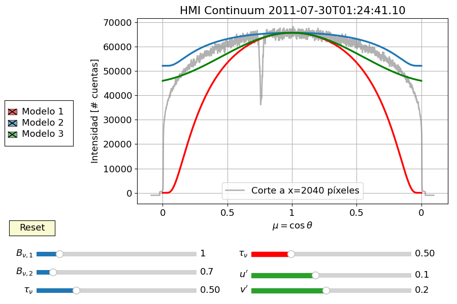

Limb\_darkening package
=============================================================================================

Limb\_darkening.modelo module
---------------------------------------------------------------------------------------------------------

Python script para hallar los coeficientes de los diferentes modelos para
el oscurecimiento del limbo. Se consideran tres casos con diferentes
formas funcionales y geometría del sistema.

 

### Limb_darkening.modelo.model1(_tau_):

Calcula la gráfica de intensidad teórica con oscurecimiento del limbo para el caso del Sol como un cuerpo esférico emitiendo radiación de cuerpo negro de intensidad específica $B_\nu$ acompañado de una atmósfera que no emite.

El oscurecimiento del limbo viene dado por:

$$I\_\\nu(\\theta) = I\_\\nu(0)\\exp\[-\\tau\_\\nu(\\sec\\theta -1)\]$$

Parámetros

  - **tau** (*float*) – Optical thickness: profundidad óptica.

 

### Limb\_darkening.modelo.model2(_tau_, _B1_, _B2_):
Calcula la gráfica de intensidad teórica con oscurecimiento del limbo para una atmósfera que tanto emite radiación como también la absorbe.

Dicho oscurecimiento viene dado por la función:

$$\\frac{I\_\\nu(\\theta)}{I\_\\nu(0)} = \\frac{(B\_{\\nu,1}-B\_{\\nu,2}) \\exp(-\\tau\_\\nu \\sec\\theta) + B\_{\\nu,2}}{(B\_{\\nu,1}-B\_{\\nu,2}) \\exp(-\\tau\_\\nu) + B\_{\\nu,2}}$$

Parámetros

*   **tau** (*float*) – Optical thickness: profundidad óptica.
    
*   **B1** (*float*) – Intensidad específica de cuerpo negro de la superficie del Sol, $B_{\nu,1}$.
    
*   **B2** (*float*) – Planckiana, función fuente de la atmósfera (suposición) para una atmósfera de espesor óptico $\tau_\nu$ y con una función fuente $B_{\nu,2}$ más fría que la superficie.
    

 

### Limb\_darkening.modelo.model3(_u_, _v_):

Calcula la gráfica de intensidad teórica con oscurecimiento del limbo para una función fuente como función de la profundidad.

Dicho modelo viene dado por:

$$I\_\\nu(\\theta) = I\_\\nu(0)\\big\[ a\_0 + a\_1\\cos\\theta + 2a\_2\\cos\^2 \\theta \\big\]$$

con:

$$a_0 = 1-u-v, \qquad a_1 = u, \qquad a_2 = \frac{1}{2}v$$

Parámetros

*   **u** (*float*) – Primer coeficiente de oscurecimiento del limbo.
    
*   **v** (*float*) – Segundo coeficiente de oscurecimiento del limbo.

 
 

## Ejemplo

Perfil de intensidad del continuo del disco solar con una mancha solar.

### Tabla de contenido

*   [Limb\_darkening package](#)
*   [Ejemplo](#)

<!--- © Derechos de autor 2022, Angel Martínez. Created using [Sphinx](https://www.sphinx-doc.org/) 4.4.0. -->
